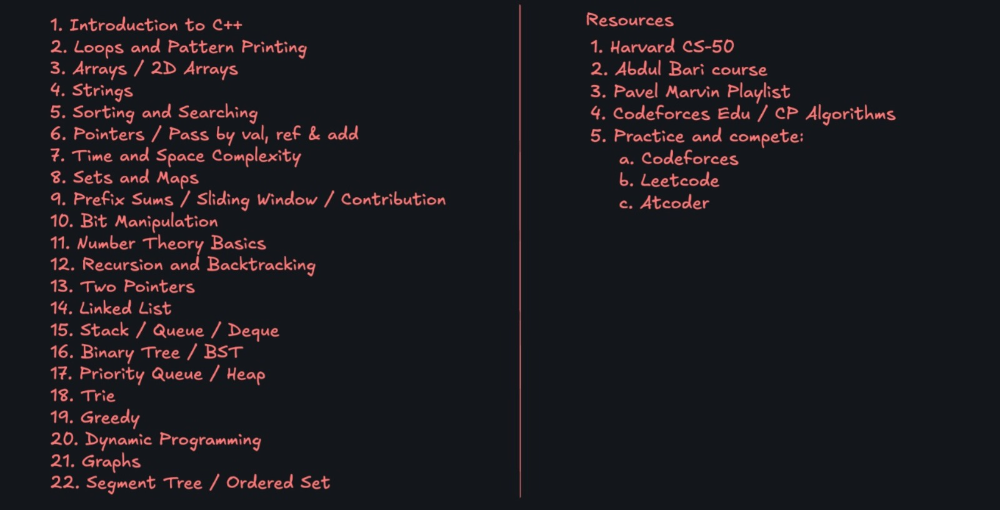
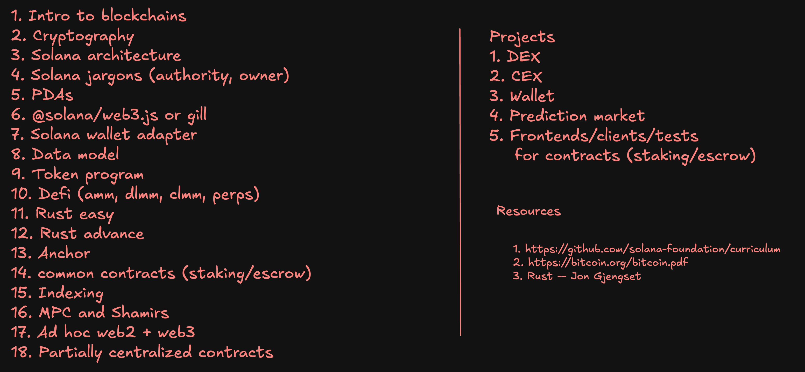
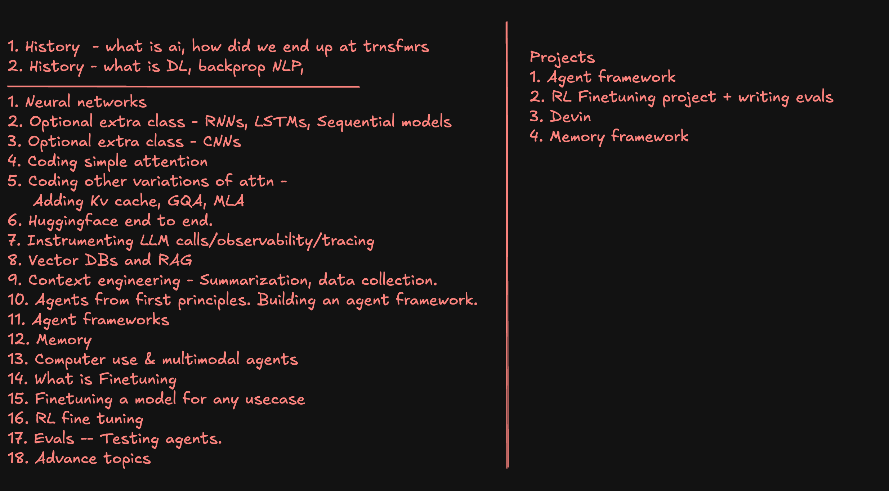
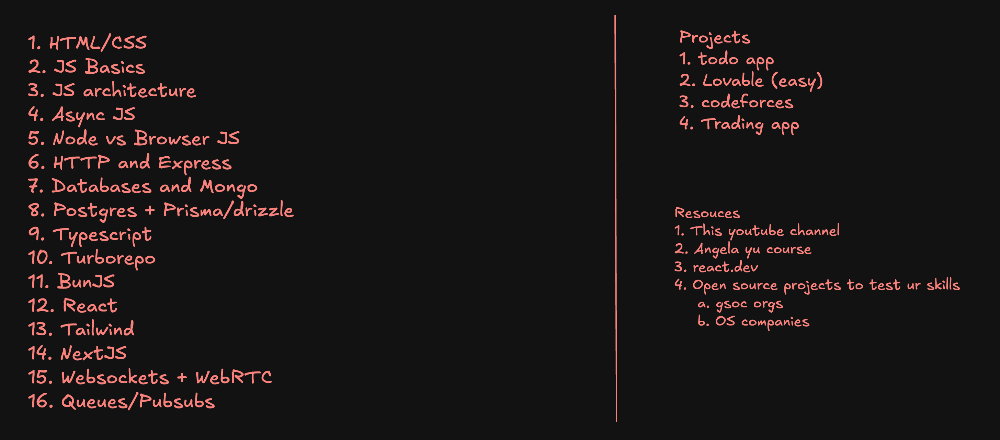
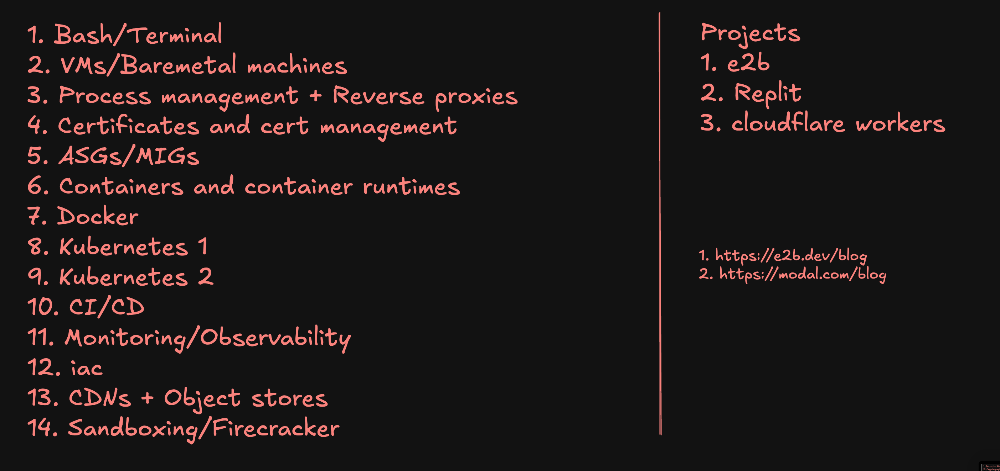

# About 100x Bootcamp 1.0

A comprehensive course by Harkirat and the 100x team.

Enroll: [harkirat.classx.co.in/new-courses](https://harkirat.classx.co.in/new-courses)

## Notes and Assignments

- Notes [Open ](https://www.notion.so/saurabh007007/100xSchool-Live-Bootcamp-Slides-2eccc4a5a11b8026b5cee818c36d0b97?source=copy_link)
- assignments [assignments.kirat.dev](https://assignments.kirat.dev/)

## Curriculum

- Data Structures & Algorithms (DSA)  
   

- Web3  
   

- AI & ML  
   

- Web Development  
   

- DevOps  
   
